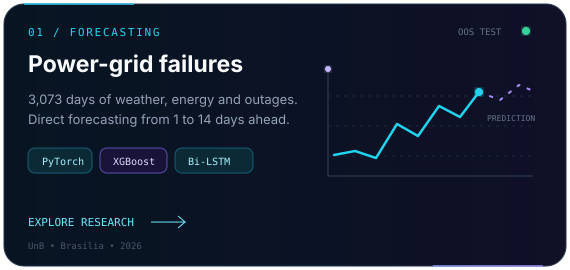
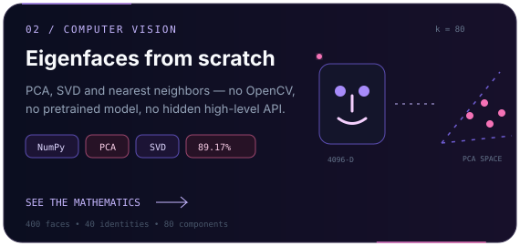
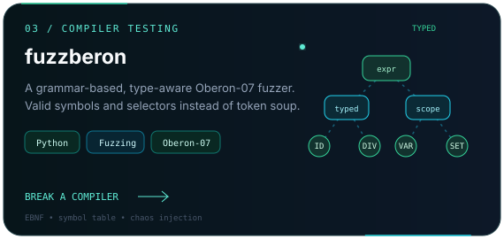
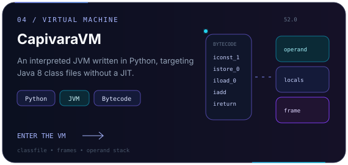
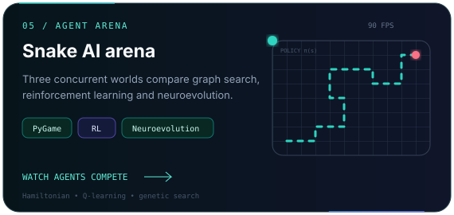
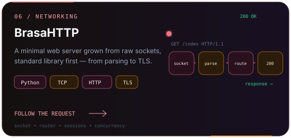

<div align="center">
  
</div>

<div align="center">
  <a href="https://github.com/Mathweuzz?tab=followers"></a>
  <a href="https://github.com/Mathweuzz?tab=repositories"></a>
</div>

<br />

```python
mateus = {
    "focus": ["applied AI", "computer vision", "compilers", "systems"],
    "method": "understand it deeply, then build it from scratch",
    "currently_training": "models that anticipate failures in Brasília's power grid",
    "curiosity": float("inf"),
}
```

I am a Computer Science developer from Brasília who likes to cross abstraction layers: from **Bi-LSTMs and Eigenfaces** to **virtual machines, compiler fuzzers, HTTP sockets, Assembly and COBOL**. My favorite projects turn theory into software you can inspect, run and question.

<div align="center">
  
</div>

## Selected experiments

<div align="center">
  <a href="https://github.com/Mathweuzz/Modelagem-Preditiva-de-Falhas-na-Rede-Eletrica-do-Distrito-Federal"></a>
  <a href="https://github.com/Mathweuzz/eigenfaces-from-scratch"></a>
  <a href="https://github.com/Mathweuzz/fuzzberon"></a>
  <a href="https://github.com/Mathweuzz/CapivaraVM"></a>
  <a href="https://github.com/Mathweuzz/Snake-IA"></a>
  <a href="https://github.com/Mathweuzz/brasa-http"></a>
</div>

## The layers I like to explore

<div align="center">
  
</div>

<br />

<details>
  <summary><b>More things I have built</b></summary>
  <br />

  - [AraraLedger](https://github.com/Mathweuzz/arara-ledger) — an educational double-entry banking core in COBOL and ISAM.
  - [Viola–Jones from scratch](https://github.com/Mathweuzz/viola-jones-from-scratch) — classical computer vision without hiding the algorithm.
  - [BASIC in Python](https://github.com/Mathweuzz/basic-in-python) — a small programming language and interpreter.
  - [Second Screen Samsung Linux](https://github.com/Mathweuzz/Second-Screen-Samsung-Linux) — low-level display experimentation in C.
  - [ConstelaçãoSQL](https://github.com/Mathweuzz/ConstelacaoSQL) — database work in PL/pgSQL.
</details>

<div align="center">
  
  <samp>Build the abstraction. Then look underneath it.</samp>
  <br /><br />
  <a href="https://github.com/Mathweuzz">github.com/Mathweuzz</a>
</div>
