<div align="center">
  
</div>

<div align="center">
  <a href="https://github.com/Mathweuzz?tab=followers"></a>
  <a href="https://github.com/Mathweuzz?tab=repositories"></a>
</div>

<br />

```python
mateus = {
    "focus": ["applied AI", "computer vision", "compilers", "systems"],
    "method": "understand it deeply, then build it from scratch",
    "currently_training": "models that anticipate failures in Brasília's power grid",
    "curiosity": float("inf"),
}
```

I am a Computer Science developer from Brasília who likes to cross abstraction layers: from **Bi-LSTMs and Eigenfaces** to **virtual machines, compiler fuzzers, HTTP sockets, Assembly and COBOL**. My favorite projects turn theory into software you can inspect, run and question.

<div align="center">
  
</div>

## Selected experiments

<table>
  <tr>
    <td width="50%" valign="top">
      <h3><code>01</code> Predicting power-grid failures</h3>
      <p>My Computer Science thesis at UnB: a strict temporal comparison of XGBoost, Bi-LSTM and Bi-GRU over <b>3,073 consecutive days</b> of weather, energy and outage data from Brazil.</p>
      <p><code>PyTorch</code> <code>XGBoost</code> <code>Time Series</code> <code>Open Data</code></p>
      <a href="https://github.com/Mathweuzz/Modelagem-Preditiva-de-Falhas-na-Rede-Eletrica-do-Distrito-Federal">Explore the research →</a>
    </td>
    <td width="50%" valign="top">
      <h3><code>02</code> Eigenfaces from scratch</h3>
      <p>Facial recognition built with linear algebra — PCA, SVD and nearest neighbors — without OpenCV, scikit-learn, pretrained models or a hidden high-level API. <b>89.17% accuracy</b> on the fixed split.</p>
      <p><code>Python</code> <code>NumPy</code> <code>Computer Vision</code> <code>PCA</code></p>
      <a href="https://github.com/Mathweuzz/eigenfaces-from-scratch">See the mathematics →</a>
    </td>
  </tr>
  <tr>
    <td width="50%" valign="top">
      <h3><code>03</code> fuzzberon</h3>
      <p>A grammar-based, type-aware fuzzer that generates near-compilable Oberon-07 programs. It carries a typed symbol table through Wirth's EBNF instead of producing token soup.</p>
      <p><code>Python</code> <code>Fuzzing</code> <code>Compilers</code> <code>Oberon-07</code></p>
      <a href="https://github.com/Mathweuzz/fuzzberon">Break a compiler →</a>
    </td>
    <td width="50%" valign="top">
      <h3><code>04</code> CapivaraVM</h3>
      <p>An interpreted Java Virtual Machine written in Python, targeting Java 8 class files. A step-by-step trip through bytecode, frames, the operand stack and runtime execution.</p>
      <p><code>Python</code> <code>JVM</code> <code>Bytecode</code> <code>Java 8</code></p>
      <a href="https://github.com/Mathweuzz/CapivaraVM">Enter the VM →</a>
    </td>
  </tr>
  <tr>
    <td width="50%" valign="top">
      <h3><code>05</code> Snake AI arena</h3>
      <p>Three concurrent Snake worlds built to compare Hamiltonian cycles, reinforcement learning and neuroevolution at 90 FPS.</p>
      <p><code>Python</code> <code>PyGame</code> <code>Neuroevolution</code> <code>RL</code></p>
      <a href="https://github.com/Mathweuzz/Snake-IA">Watch agents compete →</a>
    </td>
    <td width="50%" valign="top">
      <h3><code>06</code> BrasaHTTP</h3>
      <p>A minimal web server grown from raw Python sockets: parsing, routing, static files, sessions, concurrency, TLS and deployment — standard library first.</p>
      <p><code>Python</code> <code>TCP/IP</code> <code>HTTP</code> <code>From Scratch</code></p>
      <a href="https://github.com/Mathweuzz/brasa-http">Follow the request →</a>
    </td>
  </tr>
</table>

## The layers I like to explore

```text
       intelligence     PyTorch · XGBoost · neuroevolution · time series
            ▲
       algorithms       PCA · SVD · search · graphs · optimization
            ▲
        languages       compilers · fuzzing · parsers · Oberon · BASIC
            ▲
         runtimes       JVM bytecode · virtual machines · interpreters
            ▲
          systems       C · Assembly · sockets · Linux · SQL · COBOL
```

<div align="center">
  
</div>

<br />

<details>
  <summary><b>More things I have built</b></summary>
  <br />

  - [AraraLedger](https://github.com/Mathweuzz/arara-ledger) — an educational double-entry banking core in COBOL and ISAM.
  - [Viola–Jones from scratch](https://github.com/Mathweuzz/viola-jones-from-scratch) — classical computer vision without hiding the algorithm.
  - [BASIC in Python](https://github.com/Mathweuzz/basic-in-python) — a small programming language and interpreter.
  - [Second Screen Samsung Linux](https://github.com/Mathweuzz/Second-Screen-Samsung-Linux) — low-level display experimentation in C.
  - [ConstelaçãoSQL](https://github.com/Mathweuzz/ConstelacaoSQL) — database work in PL/pgSQL.
</details>

<div align="center">
  
  <samp>Build the abstraction. Then look underneath it.</samp>
  <br /><br />
  <a href="https://github.com/Mathweuzz">github.com/Mathweuzz</a>
</div>
